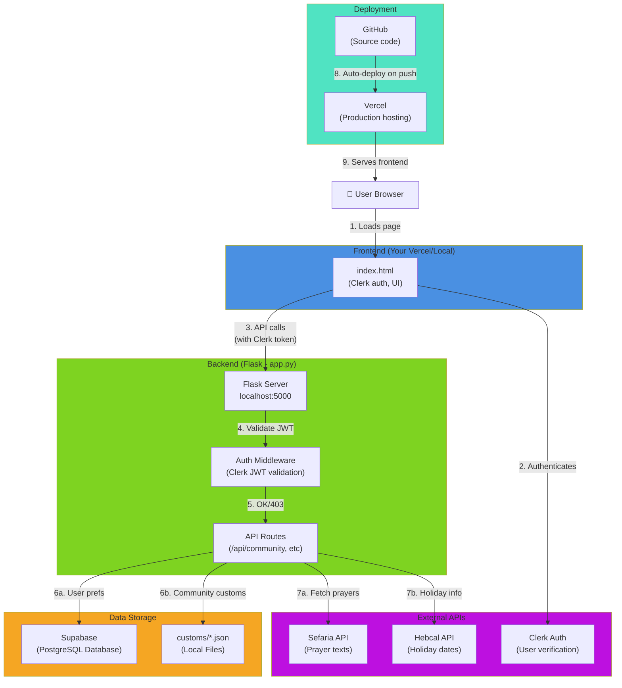

# Service Architecture Overview



## Connection Flow Details

### 1️⃣ User Authentication
```
Browser → Clerk (Login) → Clerk Token Created
         ↓
    Token stored in browser
```

### 2️⃣ API Request with Auth
```
HTML page → Click "Load prayer"
         ↓
JS sends: GET /api/community/ashkenaz
         + Header: Authorization: Bearer <clerk_token>
         ↓
Flask receives request
```

### 3️⃣ Backend Validation
```
Flask /api/community/ route
    ↓
Auth middleware validates JWT with Clerk issuer
    ↓
If valid → Continue to route handler
If invalid → Return 401 Unauthorized
```

### 4️⃣ Data Retrieval
```
Route handler executes:
    ↓
Check local customs/*.json files ← Fast (local file system)
    ↓
Optional: Query Supabase for user preferences ← Your database
    ↓
Optional: Fetch from Sefaria API ← External prayer library
    ↓
Return combined response to frontend
```

### 5️⃣ Deployment Pipeline
```
Code change → Push to GitHub
           ↓
GitHub detects push
           ↓
Vercel webhook triggered
           ↓
Vercel rebuilds and deploys
           ↓
Environment variables synced
           ↓
Live app updated at vercel URL
```

---

## Environment Variables Required at Each Stage

### Local Development (.env.local)
```
SUPABASE_URL=https://xyz.supabase.co
SUPABASE_ANON_KEY=eyJhbGc...
SUPABASE_SERVICE_ROLE_KEY=eyJhbGc...
CLERK_PUBLISHABLE_KEY=pk_test_...
CLERK_JWT_ISSUER=https://xyz.clerk.accounts.dev
CLERK_AUDIENCE=https://shelah-app.vercel.app
```

### Vercel Production (Project Settings → Environment Variables)
```
Same variables as above (Vercel copies from .env.local or you set manually)
```

### Note
- Public keys (with `NEXT_PUBLIC_` or just `CLERK_PUBLISHABLE_KEY`) can be exposed in frontend
- Service roles (`SUPABASE_SERVICE_ROLE_KEY`) must stay private (backend only)
- Clerk uses multiple "check all these places" pattern for compatibility

---

## Testing Each Connection

### Test 1: Is Supabase connected?
```bash
python3 -c "
from supabase import create_client
import os
from dotenv import load_dotenv
load_dotenv()
client = create_client(os.getenv('SUPABASE_URL'), os.getenv('SUPABASE_ANON_KEY'))
print('✅ Connected to Supabase' if client else '❌ Failed')
"
```

### Test 2: Is Clerk issuer reachable?
```bash
curl -s https://$(echo $CLERK_JWT_ISSUER | cut -d/ -f3)/.well-known/openid-configuration | jq '.issuer'
# Should return your issuer URL
```

### Test 3: Can Flask start?
```bash
python3 app.py
# Should see: "Running on http://127.0.0.1:5000" (no errors)
```

### Test 4: Can Flask reach Supabase?
```bash
curl http://localhost:5000/api/community/ashkenaz
# Should return: {"identity": {...}, "halacha_index": [...]}
```

### Test 5: Is Vercel deploying?
```bash
# Go to: https://vercel.com → Your Project → Deployments
# Latest deployment should show: ✅ Production (Success)
```

---

## Troubleshooting Connection Issues

| Symptom | Cause | Solution |
|---------|-------|----------|
| `CLERK_PUBLISHABLE_KEY is None` | Missing env var | Add to .env.local and re-run |
| `Supabase connection refused` | Network/URL wrong | Check SUPABASE_URL format and internet |
| `401 Unauthorized` on API calls | Invalid/missing Clerk token | Verify CLERK_JWT_ISSUER matches Clerk dashboard |
| `503 Service Unavailable` on Vercel | Deployment still in progress | Wait 30-60 seconds and refresh |
| Flask returns 403 on local test | CSRF protection active | This is normal, use authenticated requests |

---

Last updated: April 2026
